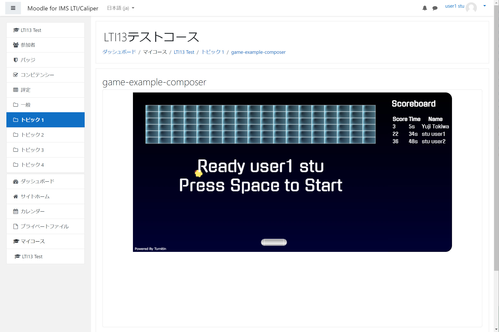

# lti13-php-example-tool-nodocker

## 概要
IMS GLC で提供している下記の LTI1.3 Tool実装例はDockerでコンテナ化した構成となっている。

https://github.com/IMSGlobal/lti-1-3-php-example-tool

また、LTI1.3 Toolのソースコード以外のPlatformのコードが組み込まれている。そのため、初めてLTI1.3を実行しようとする開発者において、エラーが生じたときにソースコードを追っていくことが難しい。また、Docker環境においてデバッグ環境を構築する知識も必要となる。そこで、X-AMPを実行環境とし、LTI1.3 Toolを実行するために必要なコードだけで構成されたパッケージを作成した。
このパッケージでは次の機能が実装されている。
- LTI1.3 Tool Core
- LTI1.3 AGS
- LTI1.3 NRPS
- LTI1.3 Deep Link

## Platform環境
LTI1.3 Toolを実行するためには LTI1.3 および Advantage を実装したPlatform が必要となる。候補としては下記が考えられるが、IMS GLC Reference ImplementationではAdvantage機能の確認時にエラーが生じてしまうので、Advantage機能の確認をするのであればMoodleが望ましい。
- IMS GLC LTI Reference Implementaion
- Moodle 3.10 (3.9以下はIMS GLC Certificationが取得されていない)

 MoodleはOpen Source Softwareであるため、AWS等で構築することができる。ただし、LTI1.3 Toolの確認だけであれば、Moodle環境の構築もひと手間かかってしまうため。テスト用のMoodleを下記のURLにて構築している。
 
 https://c3.yujitokiwa.jp/moodle/


## 実行環境
下記の環境での稼働実績を確認している。
- Windows 10
- xampp-windows-x64-7.3.23-0-VC15

XAMPPについては下記の設定が必要となる。

- IMS GLCの実装例では、実行時にNoticeレベルのエラーが生じXMLHttpRequestでやり取りされるコードがエラーを引き起こす。そのため、php.ini　において下記を設定する。
```
error_reporting=E_ALL & ~E_NOTICE

```
- https化。LTI1.3 はPlatformとTool間がTSL1.2で保証されていることが前提となっている。そのため自己証明書によるSSL化をする。localhostのSSL化の情報は多々存在するが、下記などを参考にする。
https://qiita.com/sutara79/items/21a068494bc3a08a4803
- DocumentRootの設定事例を示す。xampp/apache/conf/extra/httpd-ssl.conf　を下記に設定する。Document Root は git cloneして生成されるフォルダーではなく、{展開されたフォルダー}/web とする。
```
##### Listen is Required for LTI13
Listen 443

SSLCipherSuite HIGH:MEDIUM:!MD5:!RC4:!3DES
SSLProxyCipherSuite HIGH:MEDIUM:!MD5:!RC4:!3DES

SSLHonorCipherOrder on 

SSLProtocol all -SSLv3
SSLProxyProtocol all -SSLv3

SSLPassPhraseDialog  builtin

SSLSessionCache "shmcb:D:/xampp/apache/logs/ssl_scache(512000)"
SSLSessionCacheTimeout  300

<VirtualHost _default_:443>
#########DocumentRoot "D:/xampp/htdocs"

DocumentRoot "G:/lti13-php-example-tool-nodocker/web"

<Directory "G:/lti13-php-example-tool-nodocker/web">
    Options Indexes FollowSymLinks Includes ExecCGI
    AllowOverride All
    Require all granted
</Directory>

####ServerName localhost:443
####ServerAdmin admin@example.com
ErrorLog "D:/xampp/apache/logs/error.log"
TransferLog "D:/xampp/apache/logs/access.log"

SSLEngine on

SSLCertificateFile "conf/my-localhost.crt"
SSLCertificateKeyFile "conf/my-localhost.key"

<FilesMatch "\.(cgi|shtml|phtml|php)$">
    SSLOptions +StdEnvVars
</FilesMatch>
<Directory "D:/xampp/apache/cgi-bin">
    SSLOptions +StdEnvVars
</Directory>

BrowserMatch "MSIE [2-5]" \
         nokeepalive ssl-unclean-shutdown \
         downgrade-1.0 force-response-1.0

CustomLog "D:/xampp/apache/logs/ssl_request.log" \
          "%t %h %{SSL_PROTOCOL}x %{SSL_CIPHER}x \"%r\" %b"

</VirtualHost>       

```

## Platformからの起動

次の手順でPlatformからToolを起動する。
1. XAMPPを起動する。これで Tool はPlatformからの起動待ちとなる。
1. Moodleにログインして、コースに配置されたLTIツールのリンクをクリックする。
1. 下記に示すブロック崩しのゲームが表示される。
1. ゲームの実行はゲームの画面にカーソルをおき、スペースキーを押す。
1. 右上のScoreboardはAGSとNRPSが正常に機能すればScore, Time, Nameがコースに登録されたユーザの成績が表示される。

