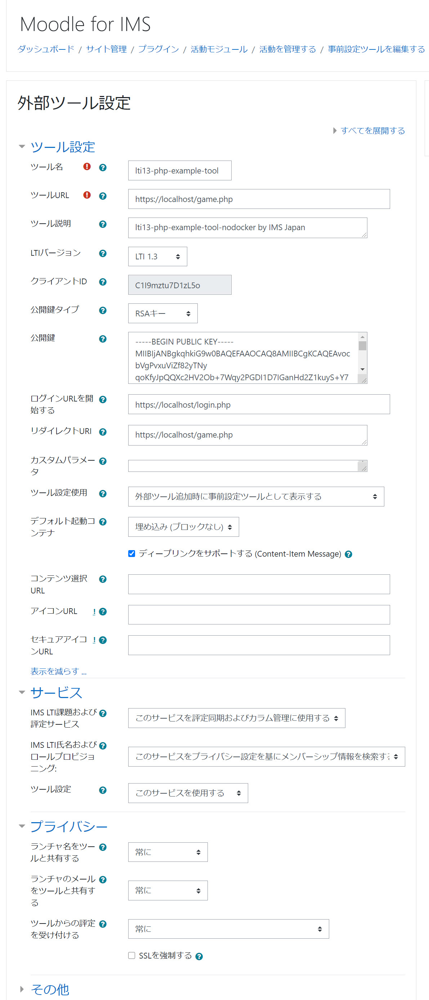

# lti13-php-example-tool-nodocker

## 概要

IMS GLC で提供している下記の LTI1.3 Tool実装例はDockerでコンテナ化した構成となっている。

https://github.com/IMSGlobal/lti-1-3-php-example-tool

また、この実装例ではLTI1.3
Toolのソースコード以外にPlatform等のコードが組み込まれている。そのため、初めてLTI1.
3を実行しようとする開発者において、エラーが生じたときにソースコードを追っていくことが難しい。また、Docker環境においてデバッグ環境を構築する知識も必要となる。そこで、XAMPPを実行環境とし、LTI1.3
Toolを実行するために必要なコードだけで構成されたパッケージに作り直した。
このパッケージでは次の機能が実装されている。

- LTI1.3 Tool Core
- LTI Advantage
  - LTI1.3 AGS (Assignment and Grade Services)  
  - LTI1.3 NRPS (Names and Role Provisioning Services)
  - LTI1.3 Deep Linking

## Platform環境

LTI1.3 Toolを実行するためには LTI1.3 および LTI Advantage を実装したPlatform が必要となる。候補としては下記が考えられるが、IMS GLC 
Reference ImplementationではAdvantage機能の確認時にエラーが生じてしまう。また、SakaiはMoodle 
に比べ大きなサーバサイズが必要で、かつ導入が難しい。そのため、LTI Advantage 機能の確認をするのであれば Moodle
が望ましい。

- IMS GLC LTI Reference Implementation
- Moodle 3.10 (3.9まではIMS GLC Certificationが取得されていない)
- Sakai

MoodleはOpen Source Softwareであるため、AWS等で構築することができる。しかしながら、LTI1.3はPlatformとTool間がTLS1.
2を前提としているためSSL証明書の設定が必要となる。 そこで、テスト用のMoodleを下記のURLにて構築している。

https://www.imsjapan.org/moodle/ (2021.xx公開予定)

## 実行環境

Toolの実行は、開発を行っているPCでWebサーバを稼働させる方法と、AWSのようなクラウドでサーバを稼働させる方法がある。ただし、いずれの方法でもCORS
問題やリモートデバッグの設定などの課題がある。
要件としては下記だけである。しかしながら、現時点ではAWS Linux2にphp7.3 + apache はyumで導入することができない。
- PHP 7.3 以上 
  
そのため XAMPPを利用する。下記の環境での稼働実績を確認している。

**開発しているローカルPC**
- Windows 10 + xampp-windows-x64-7.3.23-0-VC15

**AWSで提供されるサーバ** 
- AWS Linux2 + xampp-linux-x64-7.3.23-0-installer.run

XAMPPについては下記の設定が必要となる。

- IMS GLCの実装例では、実行時にNoticeレベルのエラーが生じXMLHttpRequestでやり取りされるコードがエラーを引き起こす。そのため、php.ini において下記を設定することが必要となる。

```
error_reporting=E_ALL & ~E_NOTICE
```

- https化。LTI1.3
  はPlatformとTool間がTSL1.2で保証されていることが前提となっている。そのため自己証明書によるSSL化をする。localhostのSSL化の情報は多々存在するが、下記などを参考にする。
  https://qiita.com/sutara79/items/21a068494bc3a08a4803
- DocumentRootの設定事例を示す。xampp/apache/conf/extra/httpd-ssl.conf を下記に設定する。Document Root は git
  cloneして生成されるフォルダーではなく、{サンプルプログラムを展開したディレクトリ}/web 
  とする。この事例では、G:/lti13-php-example-tool-nodocker　というフォルダーに git clone　している。

```
##### Listen is Required for LTI13
Listen 443

SSLCipherSuite HIGH:MEDIUM:!MD5:!RC4:!3DES
SSLProxyCipherSuite HIGH:MEDIUM:!MD5:!RC4:!3DES

SSLHonorCipherOrder on 

SSLProtocol all -SSLv3
SSLProxyProtocol all -SSLv3

SSLPassPhraseDialog  builtin

SSLSessionCache "shmcb:D:/xampp/apache/logs/ssl_scache(512000)"
SSLSessionCacheTimeout  300

<VirtualHost _default_:443>
#########DocumentRoot "D:/xampp/htdocs"

DocumentRoot "G:/lti13-php-example-tool-nodocker/web"

<Directory "G:/lti13-php-example-tool-nodocker/web">
    Options Indexes FollowSymLinks Includes ExecCGI
    AllowOverride All
    Require all granted
</Directory>

####ServerName localhost:443
####ServerAdmin admin@example.com
ErrorLog "D:/xampp/apache/logs/error.log"
TransferLog "D:/xampp/apache/logs/access.log"

SSLEngine on

SSLCertificateFile "conf/my-localhost.crt"
SSLCertificateKeyFile "conf/my-localhost.key"

<FilesMatch "\.(cgi|shtml|phtml|php)$">
    SSLOptions +StdEnvVars
</FilesMatch>
<Directory "D:/xampp/apache/cgi-bin">
    SSLOptions +StdEnvVars
</Directory>

BrowserMatch "MSIE [2-5]" \
         nokeepalive ssl-unclean-shutdown \
         downgrade-1.0 force-response-1.0

CustomLog "D:/xampp/apache/logs/ssl_request.log" \
          "%t %h %{SSL_PROTOCOL}x %{SSL_CIPHER}x \"%r\" %b"

</VirtualHost>       
```

## Moodleにおける設定

管理者権限で外部ツールを設定する。コースを担当する教員はそれを「活動もしくはリソースを追加する」にて担当するコースに設置する。



外部ツールで設定するとツールにパネルが設定される。パネルの右上に3つのアイコンが並ぶがその左側の「設定詳細を表示する」をクリックするとToolで設定すべき情報が提供される。


## Toolにおける設定

1. {サンプルプログラムを展開したディレクトリ} にて下記を実行する。vendor　ディレクトリが新規に作成され、そこにIMS LTI Library がインストールされる。
```
    composer.phar install
```
2. Moodleで外部ツールを設定したときに提供された情報を db/config/local.json に追加する。
なお、private_key_file はTool用に生成した秘密鍵を指定し、公開鍵は上述したMoodleにおける外部ツールの設定にて指定する。日本IMS協会で提供するMoodle
を使う場合には、このサンプルプログラムで使っているTool_Pri.keyをそのまま使う。
```
    "https://c3.yujitokiwa.jp/moodle": {
        "client_id": "C1I9mztu7D1zL5o",
        "auth_login_url": "https://c3.yujitokiwa.jp/moodle/mod/lti/auth.php",
        "auth_token_url": "https://c3.yujitokiwa.jp/moodle/mod/lti/token.php",
        "key_set_url": "https://c3.yujitokiwa.jp/moodle/mod/lti/certs.php",
        "private_key_file": "/Tool_Pri.key",
        "deployment": [
            "1"
        ]
    },
```
3. 自己証明書などによってSSL化したhttpdサーバーにおいて、DocumentRootは{サンプルプログラムを展開したディレクトリ}/web で設定する。

## Platformからの起動

次の手順でPlatformからToolを起動する。

1. XAMPPを起動する。これで Tool はPlatformからの起動待ちとなる。
1. Moodleにログインして、コースに配置されたLTIツールのリンクをクリックする。
1. 下記に示すブロック崩しのゲームが表示される。
1. ゲームの実行はゲームの画面にカーソルをおき、スペースキーを押す。
1. 右上のScoreboardはAGSとNRPSが正常に機能すればScore, Time, 
   Nameがコースに登録されたユーザの成績が表示される。NRPSでそのコースのユーザリストを獲得し、そのユーザ毎のSこれとTimeをAGSで獲得して表示されている。


Deep Linkingは教員ID
でログインしたとき、コースを編集モードとして外部ツールを編集すると表示される「コンテンツを選択する」クリックするときに利用される。サンプルプログラムではブロック崩しの難易度を教員が設定することができる。


## デバッグ

設定すべきパラメータが多いため、多くの場合、設定後の接続テスト直後の起動は成功しない。確認すべきことは多々あるので、代表的な確認項目を列挙する。

1. https://localhost/imsjtool.php で、login.phpやgame.phpのディレクトリにアクセスできることを確認する。
1. local.json において、同一のPlatformを異なるdeploymentナンバーで複数設定するとエラーが生じるので、不要なエントリは削除する。
1. Moodleの外部ツールの設定はデフォルトから変更されていることを確認する。
1. xdebugを導入し、PhpStormなどでBreakpointを設定してデバッグする。PhpStormはアカデミックユーザの場合、所定の手続きをすれば無償で利用できる。
1. ブラウザがFirefoxでかつPCでToolを稼働させる場合、ブラウザーオプションの証明書マネージャーにてlocalhost:443のサーバ証明書のエラー例外を設定していることを確認する。


